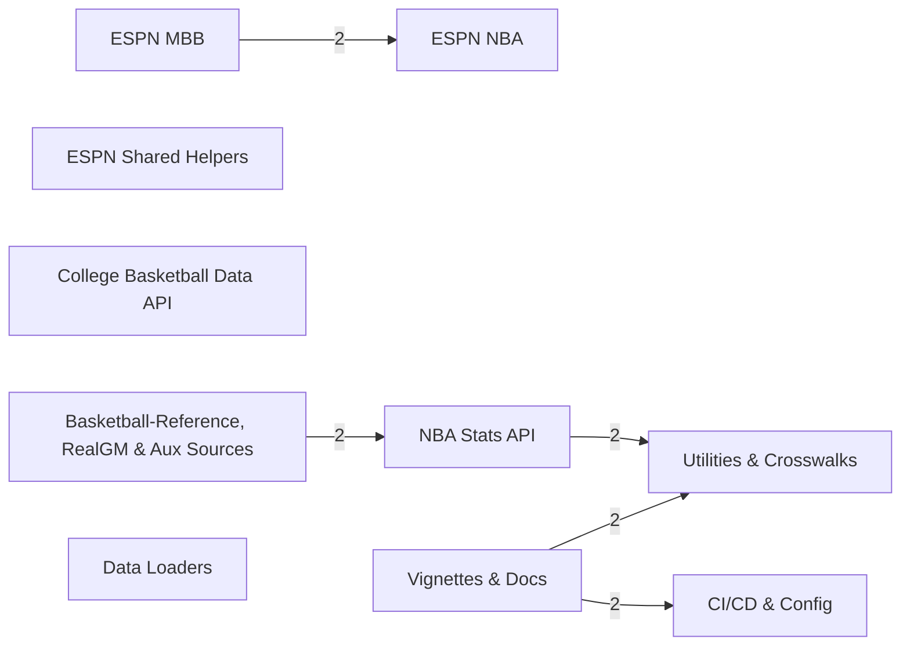

# hoopR — Codebase Index Report

> Auto-derived from the understand-anything knowledge graph (`commit 1f6b71a`).

SportsDataverse R package for mens college basketball and NBA play-by-play, schedule, roster, and stats data (ESPN + NBA Stats API).

## 1. At a glance

| Metric | Value |
|---|---|
| Files indexed | 205 |
| Total nodes | 205 (3 pipeline, 14 document, 7 config, 181 file) |
| Total edges | 124 (70 related, 41 depends_on, 13 documents) |
| Layers | 10 |
| Guided-tour steps | 12 |
| Circular dependencies | **none** ✅ |

## 2. Architectural layers

| Layer | Files | Functions | Classes | Public exports |
|---|--:|--:|--:|--:|
| ESPN MBB | 22 | 0 | 0 | 0 |
| ESPN NBA | 25 | 0 | 0 | 0 |
| ESPN Shared Helpers | 25 | 0 | 0 | 0 |
| NBA Stats API | 28 | 0 | 0 | 0 |
| College Basketball Data API | 14 | 0 | 0 | 0 |
| Basketball-Reference, RealGM & Aux Sources | 42 | 0 | 0 | 0 |
| Data Loaders | 4 | 0 | 0 | 0 |
| Utilities & Crosswalks | 4 | 0 | 0 | 0 |
| Vignettes & Docs | 26 | 0 | 0 | 0 |
| CI/CD & Config | 15 | 0 | 0 | 0 |

## 3. Dependency hotspots

**Keystones (highest fan-in):**

| File | Fan-in | Layer |
|---|--:|---|
| `R/cbbd_api_key.R` | 13 | College Basketball Data API |
| `R/bref_utils.R` | 7 | Basketball-Reference, RealGM & Aux Sources |
| `R/realgm_utils.R` | 7 | Basketball-Reference, RealGM & Aux Sources |
| `R/torvik_utils.R` | 6 | Basketball-Reference, RealGM & Aux Sources |
| `R/crosswalk_basketball.R` | 2 | Utilities & Crosswalks |
| `data-raw/pull_team_page.R` | 1 | Vignettes & Docs |
| `R/espn_basketball_athlete_helpers.R` | 1 | ESPN Shared Helpers |
| `R/espn_mbb_data.R` | 1 | ESPN MBB |
| `R/nba_metrics.R` | 1 | NBA Stats API |
| `R/nba_stats_pbp.R` | 1 | NBA Stats API |
| `R/salary_draft_utils.R` | 1 | Basketball-Reference, RealGM & Aux Sources |

**Orchestrators (highest fan-out):**

| File | Fan-out | Layer |
|---|--:|---|
| `data-raw/team_page_calls.R` | 1 | Vignettes & Docs |
| `R/bref_injuries.R` | 1 | Basketball-Reference, RealGM & Aux Sources |
| `R/bref_player_bios.R` | 1 | Basketball-Reference, RealGM & Aux Sources |
| `R/bref_player_game_log.R` | 1 | Basketball-Reference, RealGM & Aux Sources |
| `R/bref_players_stats.R` | 1 | Basketball-Reference, RealGM & Aux Sources |
| `R/bref_standings.R` | 1 | Basketball-Reference, RealGM & Aux Sources |
| `R/bref_team_roster.R` | 1 | Basketball-Reference, RealGM & Aux Sources |
| `R/bref_teams_stats.R` | 1 | Basketball-Reference, RealGM & Aux Sources |
| `R/cbbd_conferences.R` | 1 | College Basketball Data API |
| `R/cbbd_draft.R` | 1 | College Basketball Data API |

## 4. Layer dependency map

*(cross-layer file dependencies, threshold ≥2)*

## 5. Guided tour

1. **Project Overview** — Start with the README to understand what hoopR is: a SportsDataverse R package that delivers tidy men's basketball data across NBA (2002-2026) and college (2006-2026) from ESPN, the NBA Stats API, the College Basketball Data API, and auxiliary sources.
2. **Shared ESPN Basketball Helpers** — Before the per-league scrapers, hoopR factors the ESPN logic shared by NBA and MBB into one internal backend.
3. **ESPN Men's College Basketball** — espn_mbb_data.R is the heart of the MBB ESPN surface: play-by-play, team/player box scores, rosters, scoreboard, schedule, rankings, standings, and the parsers that flatten ESPN summary payloads.
4. **ESPN NBA** — The NBA ESPN surface mirrors the MBB one structurally — espn_nba_data.R provides play-by-play, box scores, rosters, schedules, and standings from ESPN Site v2, while the athlete and team-detail wrappers are direct counterparts to their MBB siblings.
5. **NBA Stats API** — Beyond ESPN, hoopR wraps the official stats.nba.com endpoints for richer data.
6. **College Basketball Data API** — The cbbd_* family wraps the third-party College Basketball Data API.
7. **Auxiliary Sources & Web Scrapers** — hoopR also scrapes sources without clean APIs.
8. **Pre-Processed Data Loaders** — Scraping live endpoints is slow; for whole-season analysis hoopR ships loaders that pull pre-scraped parquet/RDS assets from SportsDataverse-data releases.
9. **Utilities & Cross-Source Crosswalks** — utils.R is the package-wide backbone — KenPom credential handling, cached URL loaders, season/year helpers, team-name normalization, and the hoopR_data S3 class with its print method.
10. **Package Manifest & Namespace** — Two generated/authored config files define hoopR as an installable R package.
11. **Worked Examples: Vignettes** — Vignettes are hoopR's runnable tutorials and the best end-to-end view of how the layers combine.
12. **CI/CD & Docs Pipeline** — Finally, the automation that keeps hoopR healthy.

---
*Companion reports: `health-tech-debt.md`, `api-surface-catalog.md`, `diagrams.md`, `deep-dives/`.*
