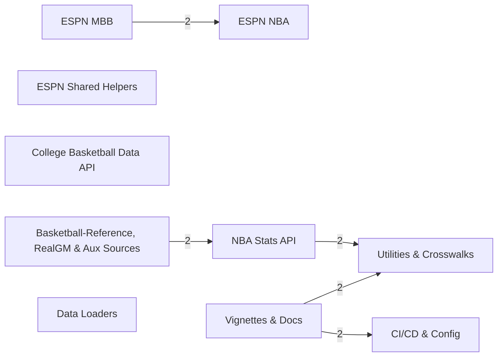
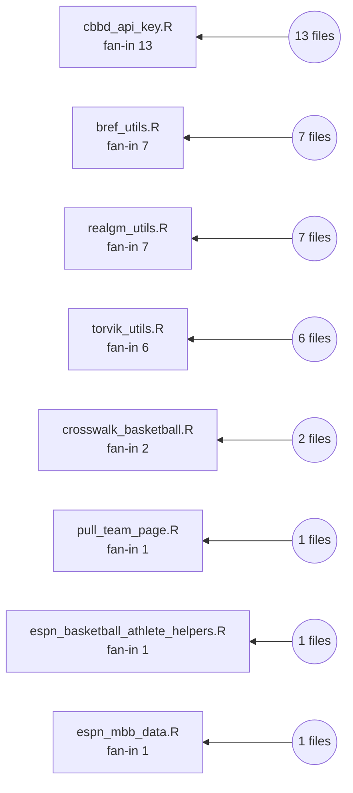
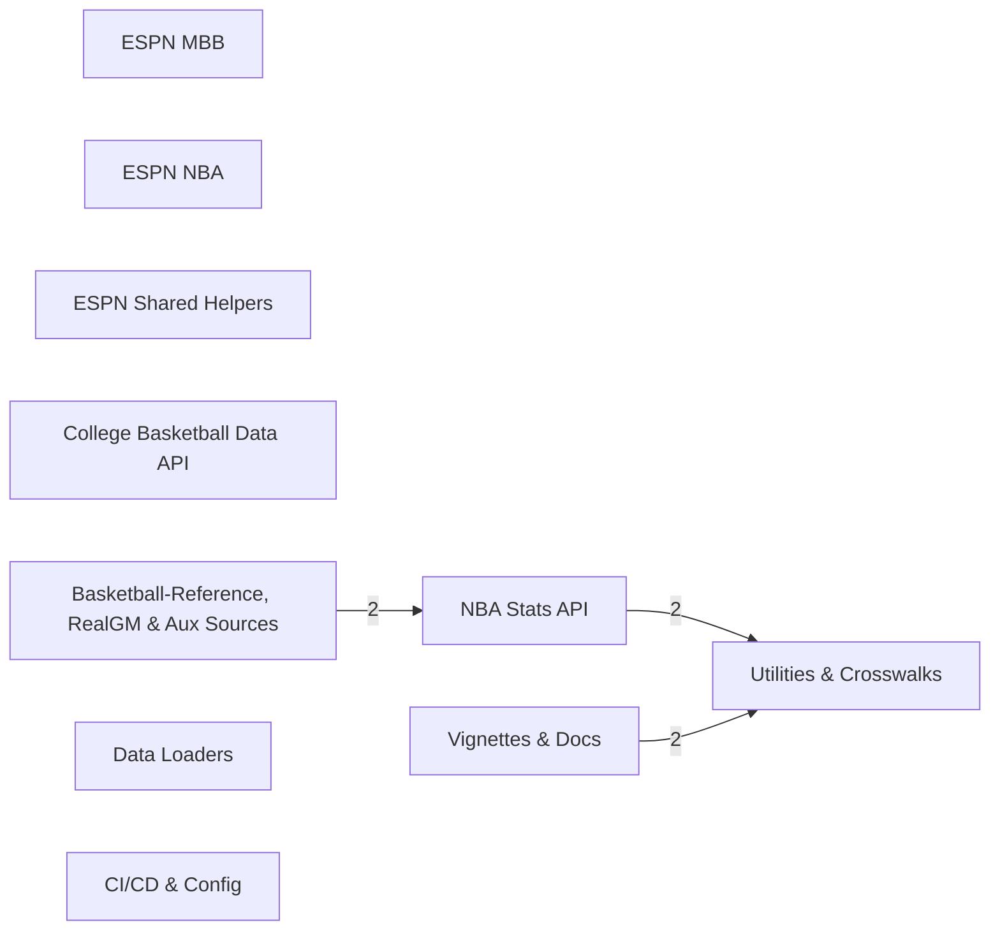

# hoopR — Diagrams

Mermaid diagrams derived from the knowledge graph.

## Layer dependency map

## Foundation hub (top keystones and how many files depend on them)

## Sport families → shared foundation (one-way fan-in)

