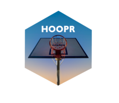

# kenpomR <a href='http://saiemgilani.github.io/kenpomR'></a>
```{r, include = FALSE}
require(knitr)
if (!requireNamespace('issue') & !requireNamespace('pacman')){
  install.packages('pacman')
}
pacman::p_load(magick, grid, dplyr, lubridate)
pacman::p_load_gh("yonicd/issue")
knitr::opts_chunk$set(
  collapse = TRUE,
  comment = "#>",
  fig.path = "man/figures/README-",
  out.width = "95%"
)
opts_template$set(stripfigure = list(fig.height = 8, out.width = "95%"))
token <- tryCatch(
  gitcreds::gitcreds_get(),
  error = function(e) NULL
)
raw_data <- issue::get_issues(
  repo = 'saiemgilani/kenpomR',
  last = 20,
  PAT  = token$password
)

tbl <- raw_data%>%
  issue::issue_tibble()
open_tbl <- tbl[tbl$pull_request==FALSE & tbl$state=="open",]
closed_tbl <- tbl[tbl$state=="closed",]
x <- open_tbl %>%
  issue::md_table() %>% 
  dplyr::mutate(
    date = lubridate::as_date(.data$created)
  ) %>% 
  dplyr::select(.data$issue, .data$icon, .data$title, .data$labels, .data$opened_by, .data$date, .data$closed)
x2 <- closed_tbl %>% 
  issue::md_table()%>% 
  dplyr::mutate(
    date = lubridate::as_date(.data$created)
  ) %>% 
  dplyr::select(.data$issue, .data$icon, .data$title, .data$labels, .data$opened_by, .data$date, .data$closed)
```


<!-- badges: start -->

[](https://github.com/saiemgilani/kenpomR/)  [](https://github.com/saiemgilani/kenpomR/actions/workflows/R-CMD-check.yaml) [](https://github.com/saiemgilani/kenpomR/) [](https://twitter.com/saiemgilani)  [](https://github.com/saiemgilani/kenpomR/graphs/contributors)
<!-- badges: end -->

[**`kenpomR`**](https://saiemgilani.github.io/kenpomR/) is an R package for working with men's basketball data. 

The package has functions to access **live play by play and box score** data from ESPN with shot locations when available.

It is additionally a scraping and aggregating interface for Ken Pomeroy's men's college basketball statistics website, [kenpom.com](https://kenpom.com). It provides users with an active subscription the capability to scrape the website tables and analyze the data for themselves.

## Installation

You can install the released version of [**`kenpomR`**](https://github.com/saiemgilani/kenpomR/) from [GitHub](https://github.com/saiemgilani/kenpomR) with:

``` r
# You can install using the pacman package using the following code:
if (!requireNamespace('pacman', quietly = TRUE)){
  install.packages('pacman')
}
pacman::p_load_current_gh("saiemgilani/kenpomR")
```

``` r
# if you would prefer devtools installation
if (!requireNamespace('devtools', quietly = TRUE)){
  install.packages('devtools')
}
# Alternatively, using the devtools package:
devtools::install_github(repo = "saiemgilani/kenpomR")
```

## Documentation

For more information on the package and function reference, please see the  [**`kenpomR`** documentation website](https://saiemgilani.github.io/kenpomR/).

## **Breaking Changes**

[**Full News on Releases**](https://saiemgilani.github.io/kenpomR/news/index.html)

# **kenpomR 0.4**

- Added support for ESPN's NBA play-by-play endpoints with the addition of the following functions:
- ```kenpomR::espn_nba_game_all()``` - a convenience wrapper function around the following three functions (returns the results as a list of three data frames)
- ```kenpomR::espn_nba_team_box()```
- ```kenpomR::espn_nba_player_box()```
- ```kenpomR::espn_nba_pbp()```
- ```kenpomR::espn_nba_teams()``` 
- ```kenpomR::espn_nba_scoreboard()``` 

<details>
<summary>View more version news</summary>

### **kenpomR 0.3.0**

- ```R``` version 3.5.0 or greater dependency added
- ```purrr``` version 0.3.0 or greater dependency added
- ```rvest``` version 1.0.0 or greater dependency added
- ```progressr``` version 0.6.0 or greater dependency added
- ```usethis``` version 1.6.0 or greater dependency added
- ```xgboost``` version 1.1.0 or greater dependency added
- ```tidyr``` version 1.0.0 or greater dependency added
- ```stringr``` version 1.3.0 or greater dependency added
- ```tibble``` version 3.0.0 or greater dependency added
- ```furrr``` dependency added
- ```future``` dependency added

### **Test coverage**

* Added tests for all KP and ESPN functions

#### **Function Naming Convention Change**

* All functions sourced from [kenpom.com](https://www.kenpom.com/) will start with `kp_` as opposed to `get_` 

* Similarly, data and metrics sourced from ESPN will begin with `espn_` as opposed to `cbb_`. Moreover, all references to `cbb_` have been changed to `mbb_` as appropriate.

* Data sourced directly from the NCAA website will start the function with `ncaa_`

#### New in v0.2.0-3: Support for ESPN's men's college basketball game data and NCAA NET Rankings

See the following ~~four~~ eight functions:

- [```kenpomR::espn_mbb_game_all()```](https://saiemgilani.github.io/kenpomR/reference/espn_mbb_game_all.html)
- [```kenpomR::espn_mbb_pbp()```](https://saiemgilani.github.io/kenpomR/reference/espn_mbb_pbp.html)
- [```kenpomR::espn_mbb_team_box()```](https://saiemgilani.github.io/kenpomR/reference/espn_mbb_team_box.html)

- [```kenpomR::espn_mbb_player_box()```](https://saiemgilani.github.io/kenpomR/reference/espn_mbb_player_box.html)

- [```kenpomR::espn_mbb_teams()```](https://saiemgilani.github.io/kenpomR/reference/espn_mbb_teams.html) (bumps to v0.2.1)

- [```kenpomR::espn_mbb_conferences()```](https://saiemgilani.github.io/kenpomR/reference/espn_mbb_conferences.html) (bumps to v0.2.1)

- [```kenpomR::espn_mbb_scoreboard()```](https://saiemgilani.github.io/kenpomR/reference/espn_mbb_scoreboard.html) (bumps to v0.2.2)
- [```kenpomR::ncaa_mbb_NET_rankings()```](https://saiemgilani.github.io/kenpomR/reference/ncaa_mbb_NET_rankings.html) (bumps to v0.2.3)
- [```kenpomR::espn_mbb_rankings()```](https://saiemgilani.github.io/kenpomR/reference/espn_mbb_rankings.html) (bumps to v0.2.3)

</details>

# Current Issues

```{r,results='asis',echo=FALSE}
x[c(1:(min(nrow(x),5))),] %>%
  knitr::kable()
```

<details><summary>View More</summary>

```{r,results='asis',echo=FALSE}
x2[c(1:(min(nrow(closed_tbl),5))),] %>%
  knitr::kable()
```

</details>
<br>


# **Our Authors**

-   [Saiem Gilani](https://twitter.com/saiemgilani)       
<a href="https://twitter.com/saiemgilani" target="blank"></a>
<a href="https://github.com/saiemgilani" target="blank"></a>
