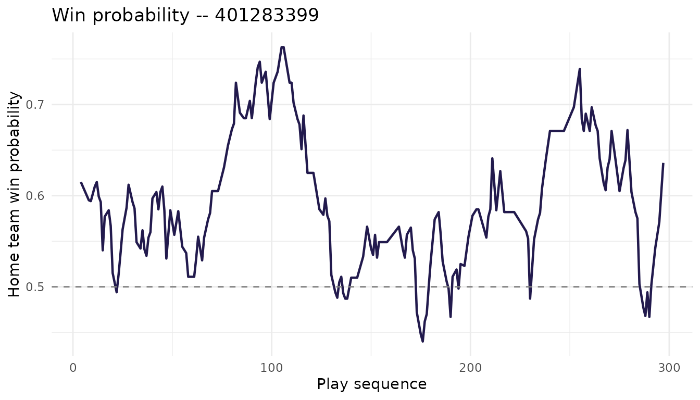

# ESPN basketball endpoints -- NBA & MBB

## What this vignette covers

If you’ve used `hoopR` before, you’ve probably reached for
[`espn_mbb_pbp()`](https://hoopR.sportsdataverse.org/reference/espn_mbb_pbp.md),
[`espn_nba_pbp()`](https://hoopR.sportsdataverse.org/reference/espn_nba_pbp.md),
and the box score wrappers. Those get you the bulk of any analysis built
around individual games. The package now also wraps a much wider slice
of ESPN’s basketball API – team rosters, schedules, league news, athlete
biographies and gamelogs, in-game win probabilities, officials,
broadcast info, the NBA draft, free agency, transactions, and
league-wide catalogs of venues, coaches, and statistical leaders. Nearly
two hundred ESPN endpoint wrappers in total, split between men’s college
basketball (`espn_mbb_*`) and the NBA (`espn_nba_*`).

This vignette is a tour of what’s available and how to compose the
pieces. Most of the chunks run live when the package website is built,
so the tables below are real ESPN responses – and every one of them
works the same way when you copy it into an interactive session.

## A note on the API surface

ESPN exposes basketball data through three public, unauthenticated API
hosts, and `hoopR` reaches into each:

- **`site.api.espn.com/apis/site/v2/sports/basketball/{league}`** is the
  most stable. It serves scoreboards, teams, rosters, schedules, news,
  injuries, standings, and player and team season stats.
- **`sports.core.api.espn.com/v2/sports/basketball/{league}`** carries
  the deeper resources: athlete indexes, per-event detail (odds, win
  probabilities, officials, broadcasts), seasons, venues, coaches, the
  NBA draft, and transactions. Big collections paginate via `$ref`
  links.
- **`site.web.api.espn.com/apis/common/v3/sports/basketball/{league}`**
  carries per-athlete deep detail – season overview, stats by category,
  game-by-game logs, situational splits. It’s the least stable of the
  three; older seasons sometimes return 404, and not every athlete is
  represented.

There’s a fourth host (`cdn.espn.com/core`) that surfaces the same
information as the site-v2 `/summary` endpoint we already parse, so we
don’t wrap it.

The league slugs in URL paths are `mens-college-basketball` and `nba`.
Those only matter if you’re building requests by hand.

**Rate limits.** ESPN doesn’t publish them. In practice, requests
arriving faster than about one per second occasionally come back as HTTP
429 or as silently empty payloads. If you’re looping over many games or
athletes, drop a `Sys.sleep(1)` between calls.

**Proxies.** ESPN wrappers don’t accept a per-call `proxy =` argument;
they call into the package’s HTTP layer directly. Set the proxy once at
the top of your session with `options(hoopR.proxy = "http://host:port")`
(or a list, for authenticated proxies) and every ESPN call will pick it
up automatically.

## What’s available, by use case

The tables below are grouped by what you’re likely trying to do.
Function names are clickable on the pkgdown reference.

### Game data

These all key off `game_id` (also called `event_id` in some endpoints –
they’re the same thing).

| Function | Returns |
|----|----|
| [`espn_mbb_game_all()`](https://hoopR.sportsdataverse.org/reference/espn_mbb_game_all.md) / [`espn_nba_game_all()`](https://hoopR.sportsdataverse.org/reference/espn_nba_game_all.md) | Full game summary as a named list |
| [`espn_mbb_pbp()`](https://hoopR.sportsdataverse.org/reference/espn_mbb_pbp.md) / [`espn_nba_pbp()`](https://hoopR.sportsdataverse.org/reference/espn_nba_pbp.md) | Play-by-play |
| [`espn_mbb_team_box()`](https://hoopR.sportsdataverse.org/reference/espn_mbb_team_box.md) / [`espn_nba_team_box()`](https://hoopR.sportsdataverse.org/reference/espn_nba_team_box.md) | Team box score |
| [`espn_mbb_player_box()`](https://hoopR.sportsdataverse.org/reference/espn_mbb_player_box.md) / [`espn_nba_player_box()`](https://hoopR.sportsdataverse.org/reference/espn_nba_player_box.md) | Player box score |
| [`espn_mbb_game_rosters()`](https://hoopR.sportsdataverse.org/reference/espn_mbb_game_rosters.md) / [`espn_nba_game_rosters()`](https://hoopR.sportsdataverse.org/reference/espn_nba_game_rosters.md) | Game-day rosters |

### Scoreboard, conferences, and league reference

| Function | Returns |
|----|----|
| [`espn_mbb_scoreboard()`](https://hoopR.sportsdataverse.org/reference/espn_mbb_scoreboard.md) / [`espn_nba_scoreboard()`](https://hoopR.sportsdataverse.org/reference/espn_nba_scoreboard.md) | Daily scoreboard |
| [`espn_mbb_teams()`](https://hoopR.sportsdataverse.org/reference/espn_mbb_teams.md) / [`espn_nba_teams()`](https://hoopR.sportsdataverse.org/reference/espn_nba_teams.md) | All teams |
| [`espn_mbb_conferences()`](https://hoopR.sportsdataverse.org/reference/espn_mbb_conferences.md) / [`espn_nba_conferences()`](https://hoopR.sportsdataverse.org/reference/espn_nba_conferences.md) | Conferences |
| [`espn_mbb_rankings()`](https://hoopR.sportsdataverse.org/reference/espn_mbb_rankings.md) | AP / coaches poll (MBB only – NBA has no poll) |
| [`espn_mbb_standings()`](https://hoopR.sportsdataverse.org/reference/espn_mbb_standings.md) / [`espn_nba_standings()`](https://hoopR.sportsdataverse.org/reference/espn_nba_standings.md) | Conference / league standings |
| [`espn_mbb_news()`](https://hoopR.sportsdataverse.org/reference/espn_mbb_news.md) / [`espn_nba_news()`](https://hoopR.sportsdataverse.org/reference/espn_nba_news.md) | League-wide news feed |
| [`espn_mbb_calendar()`](https://hoopR.sportsdataverse.org/reference/espn_mbb_calendar.md) / [`espn_nba_calendar()`](https://hoopR.sportsdataverse.org/reference/espn_nba_calendar.md) | Season calendar weeks |

### Team detail

| Function | Returns |
|----|----|
| [`espn_mbb_team()`](https://hoopR.sportsdataverse.org/reference/espn_mbb_team.md) / [`espn_nba_team()`](https://hoopR.sportsdataverse.org/reference/espn_nba_team.md) | Single-team info, record, coaches |
| [`espn_mbb_team_roster()`](https://hoopR.sportsdataverse.org/reference/espn_mbb_team_roster.md) / [`espn_nba_team_roster()`](https://hoopR.sportsdataverse.org/reference/espn_nba_team_roster.md) | Roster |
| [`espn_mbb_team_schedule()`](https://hoopR.sportsdataverse.org/reference/espn_mbb_team_schedule.md) / [`espn_nba_team_schedule()`](https://hoopR.sportsdataverse.org/reference/espn_nba_team_schedule.md) | Schedule |
| [`espn_mbb_team_leaders()`](https://hoopR.sportsdataverse.org/reference/espn_mbb_team_leaders.md) / [`espn_nba_team_leaders()`](https://hoopR.sportsdataverse.org/reference/espn_nba_team_leaders.md) | Statistical leaders |
| [`espn_mbb_team_news()`](https://hoopR.sportsdataverse.org/reference/espn_mbb_team_news.md) / [`espn_nba_team_news()`](https://hoopR.sportsdataverse.org/reference/espn_nba_team_news.md) | Team news feed |
| [`espn_mbb_team_stats()`](https://hoopR.sportsdataverse.org/reference/espn_mbb_team_stats.md) / [`espn_nba_team_stats()`](https://hoopR.sportsdataverse.org/reference/espn_nba_team_stats.md) | Team-level season stats |
| [`espn_mbb_team_injuries()`](https://hoopR.sportsdataverse.org/reference/espn_mbb_team_injuries.md) / [`espn_nba_team_injuries()`](https://hoopR.sportsdataverse.org/reference/espn_nba_team_injuries.md) | Team injury report |
| [`espn_mbb_injuries()`](https://hoopR.sportsdataverse.org/reference/espn_mbb_injuries.md) / [`espn_nba_injuries()`](https://hoopR.sportsdataverse.org/reference/espn_nba_injuries.md) | League-wide injury report |

### Athlete detail

| Function | Returns |
|----|----|
| [`espn_mbb_player_info()`](https://hoopR.sportsdataverse.org/reference/espn_mbb_player_info.md) / [`espn_nba_player_info()`](https://hoopR.sportsdataverse.org/reference/espn_nba_player_info.md) | Bio and profile |
| [`espn_mbb_player_overview()`](https://hoopR.sportsdataverse.org/reference/espn_mbb_player_overview.md) / [`espn_nba_player_overview()`](https://hoopR.sportsdataverse.org/reference/espn_nba_player_overview.md) | Season overview (web-common-v3) |
| [`espn_mbb_player_stats_v3()`](https://hoopR.sportsdataverse.org/reference/espn_mbb_player_stats_v3.md) / [`espn_nba_player_stats_v3()`](https://hoopR.sportsdataverse.org/reference/espn_nba_player_stats_v3.md) | Season stats by category |
| [`espn_mbb_player_gamelog()`](https://hoopR.sportsdataverse.org/reference/espn_mbb_player_gamelog.md) / [`espn_nba_player_gamelog()`](https://hoopR.sportsdataverse.org/reference/espn_nba_player_gamelog.md) | Game-by-game log |
| [`espn_mbb_player_splits()`](https://hoopR.sportsdataverse.org/reference/espn_mbb_player_splits.md) / [`espn_nba_player_splits()`](https://hoopR.sportsdataverse.org/reference/espn_nba_player_splits.md) | Situational splits |
| [`espn_mbb_player_eventlog()`](https://hoopR.sportsdataverse.org/reference/espn_mbb_player_eventlog.md) / [`espn_nba_player_eventlog()`](https://hoopR.sportsdataverse.org/reference/espn_nba_player_eventlog.md) | Event log (`$ref` links) |
| [`espn_mbb_player_awards()`](https://hoopR.sportsdataverse.org/reference/espn_mbb_player_awards.md) / [`espn_nba_player_awards()`](https://hoopR.sportsdataverse.org/reference/espn_nba_player_awards.md) | Awards history |
| [`espn_mbb_player_statisticslog()`](https://hoopR.sportsdataverse.org/reference/espn_mbb_player_statisticslog.md) / [`espn_nba_player_statisticslog()`](https://hoopR.sportsdataverse.org/reference/espn_nba_player_statisticslog.md) | Stats log (core-v2) |
| [`espn_mbb_player_stats()`](https://hoopR.sportsdataverse.org/reference/espn_mbb_player_stats.md) / [`espn_nba_player_stats()`](https://hoopR.sportsdataverse.org/reference/espn_nba_player_stats.md) | Cross-athlete season stats |

### Per-event enrichment

These take an `event_id` and complement the play-by-play.

| Function | Returns |
|----|----|
| [`espn_mbb_game_odds()`](https://hoopR.sportsdataverse.org/reference/espn_mbb_game_odds.md) / [`espn_nba_game_odds()`](https://hoopR.sportsdataverse.org/reference/espn_nba_game_odds.md) | Opening / closing lines (NBA only – empty for MBB) |
| [`espn_mbb_game_probabilities()`](https://hoopR.sportsdataverse.org/reference/espn_mbb_game_probabilities.md) / [`espn_nba_game_probabilities()`](https://hoopR.sportsdataverse.org/reference/espn_nba_game_probabilities.md) | Win probability per play |
| [`espn_mbb_game_officials()`](https://hoopR.sportsdataverse.org/reference/espn_mbb_game_officials.md) / [`espn_nba_game_officials()`](https://hoopR.sportsdataverse.org/reference/espn_nba_game_officials.md) | Officials |
| [`espn_mbb_game_broadcasts()`](https://hoopR.sportsdataverse.org/reference/espn_mbb_game_broadcasts.md) / [`espn_nba_game_broadcasts()`](https://hoopR.sportsdataverse.org/reference/espn_nba_game_broadcasts.md) | Broadcast outlets |

### League-wide catalogs

| Function | Returns |
|----|----|
| [`espn_mbb_leaders()`](https://hoopR.sportsdataverse.org/reference/espn_mbb_leaders.md) / [`espn_nba_leaders()`](https://hoopR.sportsdataverse.org/reference/espn_nba_leaders.md) | League statistical leaders |
| [`espn_mbb_venues()`](https://hoopR.sportsdataverse.org/reference/espn_mbb_venues.md) / [`espn_nba_venues()`](https://hoopR.sportsdataverse.org/reference/espn_nba_venues.md) | Arenas |
| [`espn_mbb_coaches()`](https://hoopR.sportsdataverse.org/reference/espn_mbb_coaches.md) / [`espn_nba_coaches()`](https://hoopR.sportsdataverse.org/reference/espn_nba_coaches.md) | Coaches |
| [`espn_mbb_athletes_index()`](https://hoopR.sportsdataverse.org/reference/espn_mbb_athletes_index.md) / [`espn_nba_athletes_index()`](https://hoopR.sportsdataverse.org/reference/espn_nba_athletes_index.md) | Full athlete index |
| [`espn_mbb_seasons()`](https://hoopR.sportsdataverse.org/reference/espn_mbb_seasons.md) / [`espn_nba_seasons()`](https://hoopR.sportsdataverse.org/reference/espn_nba_seasons.md) | Seasons on record |
| [`espn_mbb_season_info()`](https://hoopR.sportsdataverse.org/reference/espn_mbb_season_info.md) / [`espn_nba_season_info()`](https://hoopR.sportsdataverse.org/reference/espn_nba_season_info.md) | Single-season metadata |

### NBA-only (draft, free agency, transactions)

These three endpoints exist only on the NBA side – the NCAA does not run
an in-league draft and ESPN tracks free agency / transactions only at
the pro level.

| Function | Returns |
|----|----|
| [`espn_nba_draft()`](https://hoopR.sportsdataverse.org/reference/espn_nba_draft.md) | Draft picks by season |
| [`espn_nba_freeagents()`](https://hoopR.sportsdataverse.org/reference/espn_nba_freeagents.md) | Free agents (during the FA window) |
| [`espn_nba_transactions()`](https://hoopR.sportsdataverse.org/reference/espn_nba_transactions.md) | Transactions log |

## Worked examples

The examples below use Duke (`team_id = 150`) for MBB and the Los
Angeles Lakers (`team_id = 13`) for the NBA. Most ESPN team IDs and
athlete IDs are easy to discover with
[`espn_mbb_teams()`](https://hoopR.sportsdataverse.org/reference/espn_mbb_teams.md)
/
[`espn_nba_teams()`](https://hoopR.sportsdataverse.org/reference/espn_nba_teams.md)
and the various roster endpoints.

### Browsing news and the season calendar

When you’re starting a new analysis, the easiest way to confirm the
season is active and you’re hitting current data is to pull the news
feed and the calendar.

``` r

library(hoopR)

# Latest 10 MBB news items
mbb_news <- espn_mbb_news(limit = 10)
head(mbb_news[, c("headline", "published")])
#> # A tibble: 6 × 2
#>   headline                                                          published   
#>   <chr>                                                             <chr>       
#> 1 Nick Saban asks Congress to 'bring order' via college sports bill 2026-06-03T…
#> 2 Girls' basketball recruiting: The 2027, 2028, 2029 race for No. 1 2026-06-03T…
#> 3 SEC, Big Ten withhold support for landmark college sports bill    2026-06-03T…
#> 4 Alabama's Holloway enters program to dismiss felony charges       2026-06-03T…
#> 5 Men's NCAA basketball 2026-27 Way-Too-Early Top 25 rankings       2026-06-02T…
#> 6 Best of Jordan Clarkson in the NBA Playoffs                       2026-06-02T…

# 2025 MBB season calendar
mbb_cal <- espn_mbb_calendar(season = 2025)
head(mbb_cal)
#> # A tibble: 6 × 12
#>   season season_type season_type_label season_start_date season_end_date  
#>   <chr>  <chr>       <chr>             <chr>             <chr>            
#> 1 2025   NA          NA                2024-07-13T07:00Z 2025-04-09T06:59Z
#> 2 2025   NA          NA                2024-07-13T07:00Z 2025-04-09T06:59Z
#> 3 2025   NA          NA                2024-07-13T07:00Z 2025-04-09T06:59Z
#> 4 2025   NA          NA                2024-07-13T07:00Z 2025-04-09T06:59Z
#> 5 2025   NA          NA                2024-07-13T07:00Z 2025-04-09T06:59Z
#> 6 2025   NA          NA                2024-07-13T07:00Z 2025-04-09T06:59Z
#> # ℹ 7 more variables: calendar_type <chr>, label <chr>, alternate_label <chr>,
#> #   detail <chr>, value <chr>, start_date <chr>, end_date <chr>

# Same on the NBA side
nba_news <- espn_nba_news(limit = 10)
nba_cal  <- espn_nba_calendar(season = 2025)
```

The calendar tibble carries one row per scheduling block (preseason,
regular season, postseason, championship weeks, etc.), with start and
end dates. It’s useful for filtering schedules and scoreboards down to a
specific portion of the year.

### Looking at a team

[`espn_mbb_team()`](https://hoopR.sportsdataverse.org/reference/espn_mbb_team.md)
and
[`espn_nba_team()`](https://hoopR.sportsdataverse.org/reference/espn_nba_team.md)
return a small named list with high-level identity, record, next event,
and coaching info. Pair it with the roster, schedule, and team-leader
wrappers when you want a fuller picture.

``` r

# Duke at a glance
duke <- espn_mbb_team(team_id = 150, season = 2025)
names(uconn)        # Info, Record, NextEvent, StandingSummary, Coaches
#> Error:
#> ! object 'uconn' not found

# Current roster
duke_roster <- espn_mbb_team_roster(team_id = 150, season = 2025)
head(uconn_roster[, c("athlete_display_name", "position_name", "jersey")])
#> Error:
#> ! object 'uconn_roster' not found

# Regular-season schedule
duke_sched <- espn_mbb_team_schedule(
  team_id = 150, season = 2025, season_type = 2
)
head(uconn_sched[, c("name", "date", "home_away", "score")])
#> Error:
#> ! object 'uconn_sched' not found

# Statistical leaders for the team
duke_ldrs <- espn_mbb_team_leaders(team_id = 150, season = 2025)
head(uconn_ldrs)
#> Error:
#> ! object 'uconn_ldrs' not found
```

The same shape applies to NBA teams – `espn_nba_team(17, 2025)` for the
Aces, plus `_team_roster()`, `_team_schedule()`, and so on.

A small caveat on the roster and leaders endpoints: ESPN serves only the
*current* roster and leaders for each team, regardless of any `season`
you pass. The argument is preserved in the function signature for API
symmetry, but it doesn’t change the request URL.

### Tracking injuries

Injury data is a soft spot in ESPN’s MBB coverage – most college games
don’t carry an active injury report. NBA injuries are more reliably
populated when the league is in season.

``` r

# Whole league
nba_inj <- espn_nba_injuries(season = 2025)

# Single team
lakers_inj <- espn_nba_team_injuries(team_id = 13)

# MBB injuries are sparse on ESPN -- an empty tibble is the normal case
mbb_inj <- espn_mbb_injuries(season = 2025)
```

If you’re building a workflow that depends on injury data, gate
downstream code on `nrow(...) > 0`.

### Following an athlete

The athlete endpoints are the deepest part of the surface. Pull a
roster, pick a player, and you have biographical data, season-level
totals, a per-game log, situational splits, and an awards history all
keyed off the same `athlete_id`.

``` r

library(dplyr)

duke_roster <- espn_mbb_team_roster(team_id = 150, season = 2025)

athlete_id   <- uconn_roster$athlete_id[1]
#> Error:
#> ! object 'uconn_roster' not found
athlete_name <- uconn_roster$athlete_display_name[1]
#> Error:
#> ! object 'uconn_roster' not found
message("Selected: ", athlete_name, " (", athlete_id, ")")
#> Error:
#> ! object 'athlete_name' not found

# Bio and profile
bio <- espn_mbb_player_info(athlete_id = athlete_id)
#> Error:
#> ! object 'athlete_id' not found
glimpse(bio)
#> Error:
#> ! object 'bio' not found

# Season overview (web-common-v3)
overview <- espn_mbb_player_overview(
  athlete_id = athlete_id, season = 2025
)
#> Error:
#> ! object 'athlete_id' not found
names(overview)
#> Error:
#> ! object 'overview' not found

# Game-by-game log
gamelog <- espn_mbb_player_gamelog(
  athlete_id = athlete_id, season = 2025
)
#> Error:
#> ! object 'athlete_id' not found
head(gamelog[, c("game_date", "opponent", "points", "rebounds", "assists")])
#> Error:
#> ! object 'gamelog' not found

# Situational splits (home/away, by month, vs ranked, ...)
splits <- espn_mbb_player_splits(
  athlete_id = athlete_id, season = 2025
)
#> Error:
#> ! object 'athlete_id' not found
head(splits)
#> Error:
#> ! object 'splits' not found
```

Everything above works the same on the NBA side – swap `espn_mbb_*` for
`espn_nba_*` and use a NBA `athlete_id` (A’ja Wilson is `"1966"`).

A few things to know about the athlete endpoints:

- `espn_*_athlete_eventlog()` returns `$ref` URL columns rather than
  parsed game stats. Reach for `espn_*_athlete_gamelog()` if you want
  per-game numbers in tibble form.
- `espn_*_athlete_awards()` is sparse. Many athletes have no
  ESPN-recorded awards, so an empty tibble is normal.
- The web-common-v3 endpoints (`_athlete_overview`, `_athlete_stats`,
  `_athlete_gamelog`, `_athlete_splits`) are less stable than the rest
  of the surface. Some seasons before roughly 2018 return HTTP 404, and
  not every athlete is in the index.

### Charting win probability

The combination of `_pbp()` and `_event_probabilities()` is the quickest
way to chart a game’s momentum. Event `'401283399'` below is a 2024 NBA
regular-season game.

``` r

library(hoopR)
library(dplyr)
library(ggplot2)

game_id <- "401283399"

pbp   <- espn_nba_pbp(game_id = game_id)
probs <- espn_nba_game_probabilities(event_id = game_id, limit = 200)

plot_data <- probs %>%
  mutate(seq = as.integer(sequence_number)) %>%
  arrange(seq)

ggplot(plot_data, aes(x = seq, y = as.numeric(home_win_percentage))) +
  geom_line(color = "#221A4D", linewidth = 0.8) +
  geom_hline(yintercept = 0.5, linetype = "dashed", color = "grey50") +
  labs(
    title = paste("Win probability --", game_id),
    x = "Play sequence",
    y = "Home team win probability"
  ) +
  theme_minimal()
```



You can layer in scoring plays from `pbp` to label momentum swings, or
join `_event_officials()` and `_event_broadcasts()` if you want
contextual annotations.

``` r

# Pre-game odds (populated when ESPN carries lines)
odds <- espn_nba_game_odds(event_id = game_id)

# Officials
officials <- espn_nba_game_officials(event_id = game_id)
officials[, c("full_name", "position")]
#> Error in `officials[, c("full_name", "position")]`:
#> ! Can't subset columns that don't exist.
#> ✖ Column `position` doesn't exist.

# Broadcast outlets
broadcasts <- espn_nba_game_broadcasts(event_id = game_id)
broadcasts[, c("market", "names")]
#> Error in `broadcasts[, c("market", "names")]`:
#> ! Can't subset columns that don't exist.
#> ✖ Column `market` doesn't exist.
```

ESPN doesn’t carry betting lines for NCAA games, so
[`espn_mbb_game_odds()`](https://hoopR.sportsdataverse.org/reference/espn_mbb_game_odds.md)
always returns an empty tibble. The function exists for API symmetry;
it’s not a bug. Win probabilities, officials, and broadcasts are all
populated for both leagues.

### Working with the NBA draft and transactions

The draft, free agency, and transaction logs only exist on the NBA side
– the NCAA doesn’t have a pro-style draft on ESPN, and the transfer
portal isn’t part of ESPN’s basketball API.

``` r

# 2025 NBA draft picks
draft_2025 <- espn_nba_draft(season = 2025)
head(draft_2025[, c("pick", "round", "team_name", "athlete_display_name")])
#> Error in `draft_2025[, c("pick", "round", "team_name", "athlete_display_name")]`:
#> ! Can't subset columns that don't exist.
#> ✖ Columns `team_name` and `athlete_display_name` don't exist.

# Recent transactions (waivers, trades, signings)
txn <- espn_nba_transactions(season = 2025, limit = 100)
head(txn[, c("date", "type", "athlete_display_name", "team_name")])
#> Error in `txn[, c("date", "type", "athlete_display_name", "team_name")]`:
#> ! Can't subset columns that don't exist.
#> ✖ Columns `athlete_display_name` and `team_name` don't exist.

# Free agents -- empty outside the FA window, which is roughly
# January through April each year
fa <- espn_nba_freeagents(season = 2025)
nrow(fa)
#> [1] 0
```

If you’re stitching together a roster history, the natural sequence is
draft -\> free agents -\> transactions, joined on `athlete_id`.

### Browsing league-wide catalogs

Sometimes you don’t have a specific team or athlete in mind – you want
the league-wide leaderboard, every venue, every coach, or the full
athlete index. The catalog endpoints cover that.

``` r

# Statistical leaders (points, rebounds, assists, ...)
nba_ldrs <- espn_nba_leaders(season = 2024, season_type = 2)
head(nba_ldrs)
#> # A tibble: 6 × 11
#>   season season_type category      abbreviation athlete_id athlete_name team_id
#>    <int>       <int> <chr>         <chr>        <chr>      <chr>        <chr>  
#> 1   2024           2 pointsPerGame PTS          3059318    NA           20     
#> 2   2024           2 pointsPerGame PTS          3945274    NA           6      
#> 3   2024           2 pointsPerGame PTS          3032977    NA           15     
#> 4   2024           2 pointsPerGame PTS          4278073    NA           25     
#> 5   2024           2 pointsPerGame PTS          3934672    NA           18     
#> 6   2024           2 pointsPerGame PTS          3202       NA           21     
#> # ℹ 4 more variables: team_abbrev <chr>, value <dbl>, rank <int>,
#> #   display_value <chr>

# Every NBA arena ESPN tracks
nba_venues <- espn_nba_venues()
head(nba_venues[, c("full_name", "city", "state", "capacity")])
#> Error in `nba_venues[, c("full_name", "city", "state", "capacity")]`:
#> ! Can't subset columns that don't exist.
#> ✖ Columns `city` and `state` don't exist.

# Coaches (current season)
mbb_coaches <- espn_mbb_coaches(season = 2025)
head(mbb_coaches[, c("full_name", "team_name", "experience")])
#> Error in `mbb_coaches[, c("full_name", "team_name", "experience")]`:
#> ! Can't subset columns that don't exist.
#> ✖ Column `team_name` doesn't exist.
```

The athlete index is the largest of the catalog endpoints – expect
6,000+ rows for a recent MBB season. Pagination is handled internally,
but for exploratory pulls you’ll usually want a small `limit`.

``` r

# NBA -- a couple hundred active players
nba_athletes <- espn_nba_athletes_index(
  season = 2025, active = TRUE, limit = 5000
)
nrow(nba_athletes)
#> [1] 845
head(nba_athletes[, c("display_name", "position_name", "team_name")])
#> Error in `nba_athletes[, c("display_name", "position_name", "team_name")]`:
#> ! Can't subset columns that don't exist.
#> ✖ Columns `display_name`, `position_name`, and `team_name` don't exist.

# MBB -- cap at 50 rows just to peek; the default limit is 25,000
mbb_athletes <- espn_mbb_athletes_index(season = 2025, limit = 50)
head(mbb_athletes[, c("display_name", "position_name", "team_name")])
#> Error in `mbb_athletes[, c("display_name", "position_name", "team_name")]`:
#> ! Can't subset columns that don't exist.
#> ✖ Columns `display_name`, `position_name`, and `team_name` don't exist.
```

The seasons catalog is mostly handy when you want to know which years
ESPN has on record before you start a multi-season pull.

``` r

nba_seasons <- espn_nba_seasons()
head(nba_seasons[, c("year", "start_date", "end_date")])
#> Error in `nba_seasons[, c("year", "start_date", "end_date")]`:
#> ! Can't subset columns that don't exist.
#> ✖ Column `year` doesn't exist.

# Single-season metadata is mostly $ref URLs to sub-resources, so
# espn_*_seasons() is usually the more useful starting point
nba_s2025 <- espn_nba_season_info(season = 2025)
```

## Core-v2 deep expansion

The post-3.0.0 release adds another ~73 ESPN core-v2 wrappers to
`espn_nba_*` + `espn_mbb_*`, bringing the total ESPN basketball surface
in `hoopR` to **199 functions**. Everything here is shimmed over an
internal `.espn_basketball_*` helper so NBA and MBB share parsing logic
and bug fixes propagate to both leagues at once.

### Function overview

| Tier | Family | NBA | MBB | What it gives you |
|----|----|----|----|----|
| 1 / 2A | `athlete_career_stats` | ✓ | ✓ | Long-format career stats (1 row per stat). Default fetches RS + post and binds. |
| 1 / 2A | `athlete_seasons` | ✓ | ✓ | Index of seasons an athlete played, with `$ref`s to season-scoped detail |
| 1 / 2A | `franchises` / `franchise` | ✓ | ✓ | League franchise index + per-franchise detail (stable across relocations) |
| 1 / 2A | `futures` | ✓ | ✓ | Per-season betting futures markets in long format |
| 1 / 2A | `tournaments` / `tournament` / `tournament_seasons` | ✓ | ✓ | NBA Cup (1) / NCAA tournament (3) index + per-tournament + per-season list |
| 1 / 2A | `team_record` / `team_odds_records` | ✓ | ✓ | W-L / record types and against-the-spread records by season |
| 1 / 2A | `team_depthchart` | ✓ | — | NBA-only depth chart |
| 1 / 2A | `team_season_profile` / `team_season_roster` | ✓ | ✓ | Per-(team × season) profile and roster |
| 1 / 2A | `coach` / `coach_season` | ✓ | ✓ | Coach detail; coach-in-a-season |
| 1 / 2A | `powerindex` | ✓ | ✓ | Per-season power-index entries per team |
| 1 / 2A | `season_info` / `season_type` / `season_types` | ✓ | ✓ | Season metadata (top-level + per-season-type) |
| 1 / 2A | `season_leaders` | ✓ | ✓ | Per-(season × season-type) leader board, long format. Defaults fetch RS + post. |
| 1 / 2A | `season_rankings` / `season_ranking` | ✓ | ✓ | Per-season poll/ranking indexes |
| 1 / 2A | `season_weeks` / `season_week` | ✓ | ✓ | Weeks within a season (week-based leagues) |
| 1 / 2A | `week_rankings` / `week_ranking` | ✓ | ✓ | Per-week ranking lookups |
| 1 / 2A | `season_groups` / `season_group` / `season_group_children` / `season_group_teams` | ✓ | ✓ | Conferences / divisions / D-I groups within a season |
| 1 / 2A | `season_awards` / `award` | ✓ | ✓ | Per-season awards index + per-award detail |
| 1 / 2A | `draft_pick` | ✓ | — | Single pick lookup |
| 2B.1 | `athlete_eventlog_v2` | ✓ | ✓ | Per-(athlete × season) event log (core-v2; richer than the web-common-v3 variant) |
| 2B.1 | `draft_rounds` / `draft_athletes` / `draft_status` | ✓ | — | Draft year completion: rounds, draftees, in-progress status |
| 2B.2 | `event_situation` | ✓ | ✓ | Live game situation: timeouts, fouls, bonus state, last play `$ref` |
| 2B.2 | `event_predictor` | ✓ | ✓ | Pre-game predictor stats (one row per team × stat) |
| 2B.2 | `event_powerindex` | ✓ | ✓ | Per-event power-index index. Sparse coverage. |
| 2B.2 | `event_propbets` | ✓ | ✓ | Per-(event × provider) prop-bet markets in long format |
| 2B.3 | `event_competitor_linescores` | ✓ | ✓ | Per-quarter scoring for one team in one event |
| 2B.3 | `event_competitor_leaders` | ✓ | ✓ | Top performers per team in long format |
| 2B.3 | `event_competitor_roster` | ✓ | ✓ | Game-day roster index — athlete ids + `$ref`s |
| 2B.3 | `event_competitor_statistics` | ✓ | ✓ | Full team-game statistics in long format |
| 2B.3 | `event_competitor_records` | ✓ | ✓ | Team records as of the event (overall / home / away / conf / div) |
| 2D | `positions` / `position` | ✓ | ✓ | Position dictionary index + detail (id-by-league, **not** shared) |
| 2E.1 | `event_player_box` | ✓ | ✓ | **Per-game player box score**, long format |
| 2E.1 | `event_competitor_roster_entry` | ✓ | ✓ | Single roster row: starter / DNP / ejection / sub slot |
| 2E.1 | `event_play` | ✓ | ✓ | Single-play detail (sequence, period, clock, scoring flags, coords) |
| 2E.1 | `event_play_personnel` | ✓ | ✓ | Players on court at a specific play. Sparse coverage. |
| 2E.2 | `event_competitor_score` | ✓ | ✓ | Single-row final score (value, displayValue, winner, source) |
| 2E.2 | `team_season_statistics` | ✓ | ✓ | Full team-season stat sheet in long format, with league rank per stat |
| 2E.2 | `season_draft` | ✓ | — | Draft-year top-level metadata |
| 2F | `event_official_detail` | ✓ | ✓ | Per-official detail. URL uses crew `order` (1-indexed), not the ESPN stable id. |
| 2F | `team_record_detail` | ✓ | ✓ | Per-record stat array in long format |
| 2F | `coach_record` | ✓ | ✓ | Coach career record by type (Total / Pre Season / Regular Season / Post Season) |
| 2F | `tournament_season` | ✓ | ✓ | Single tournament-year detail |
| 2F | `draft_athlete_detail` | ✓ | — | Rich single-row drafted-player record |

Dashes mark families that don’t apply at ESPN for that league (no MBB
in-league draft, no MBB depth chart endpoint).

### Athlete career, contracts, splits, and event log

Beyond the gamelog and per-season stats wrappers we shipped in the
initial ESPN batch, the core-v2 surface adds career-level rollups,
season-by-season indexes, and a richer event log.

``` r

library(hoopR)

# Career stats — long format, one row per (stat_type x category x stat).
# Default `stat_type = c(0L, 1L)` fetches regular season + postseason and
# binds them so a single call gives you the player's full career sheet.
flagg_career <- espn_mbb_player_career_stats(athlete_id = 4432809)
lebron_career     <- espn_nba_player_career_stats(athlete_id = 1966)

# Per-(athlete x season) event log -- core-v2 variant. Returns
# event_id + result + per-event stats in long format.
espn_nba_player_eventlog_v2(athlete_id = 1966, season = 2024)
#> # A tibble: 25 × 8
#>    league athlete_id season event_id  team_id played event_ref   competition_ref
#>    <chr>  <chr>       <int> <chr>     <chr>   <lgl>  <chr>       <chr>          
#>  1 nba    1966         2024 401591880 13      TRUE   http://spo… http://sports.…
#>  2 nba    1966         2024 401591892 13      FALSE  http://spo… http://sports.…
#>  3 nba    1966         2024 401591902 13      TRUE   http://spo… http://sports.…
#>  4 nba    1966         2024 401591909 13      FALSE  http://spo… http://sports.…
#>  5 nba    1966         2024 401591931 13      TRUE   http://spo… http://sports.…
#>  6 nba    1966         2024 401584689 13      TRUE   http://spo… http://sports.…
#>  7 nba    1966         2024 401584704 13      TRUE   http://spo… http://sports.…
#>  8 nba    1966         2024 401584728 13      TRUE   http://spo… http://sports.…
#>  9 nba    1966         2024 401584739 13      TRUE   http://spo… http://sports.…
#> 10 nba    1966         2024 401584755 13      TRUE   http://spo… http://sports.…
#> # ℹ 15 more rows

# Index of seasons an athlete has on file (good for iterating).
espn_nba_player_seasons(athlete_id = 1966)
#> # A tibble: 23 × 4
#>    league athlete_id season ref                                                 
#>    <chr>  <chr>       <int> <chr>                                               
#>  1 nba    1966         2026 http://sports.core.api.espn.com/v2/sports/basketbal…
#>  2 nba    1966         2025 http://sports.core.api.espn.com/v2/sports/basketbal…
#>  3 nba    1966         2024 http://sports.core.api.espn.com/v2/sports/basketbal…
#>  4 nba    1966         2023 http://sports.core.api.espn.com/v2/sports/basketbal…
#>  5 nba    1966         2022 http://sports.core.api.espn.com/v2/sports/basketbal…
#>  6 nba    1966         2021 http://sports.core.api.espn.com/v2/sports/basketbal…
#>  7 nba    1966         2020 http://sports.core.api.espn.com/v2/sports/basketbal…
#>  8 nba    1966         2019 http://sports.core.api.espn.com/v2/sports/basketbal…
#>  9 nba    1966         2018 http://sports.core.api.espn.com/v2/sports/basketbal…
#> 10 nba    1966         2017 http://sports.core.api.espn.com/v2/sports/basketbal…
#> # ℹ 13 more rows
```

### Franchises, tournaments, and league dictionaries

``` r

# Franchise records are stable across relocations and rebrands.
espn_nba_franchises()
#> # A tibble: 30 × 3
#>    franchise_id ref                                                       league
#>    <chr>        <chr>                                                     <chr> 
#>  1 1            http://sports.core.api.espn.com/v2/sports/basketball/lea… nba   
#>  2 2            http://sports.core.api.espn.com/v2/sports/basketball/lea… nba   
#>  3 3            http://sports.core.api.espn.com/v2/sports/basketball/lea… nba   
#>  4 4            http://sports.core.api.espn.com/v2/sports/basketball/lea… nba   
#>  5 5            http://sports.core.api.espn.com/v2/sports/basketball/lea… nba   
#>  6 6            http://sports.core.api.espn.com/v2/sports/basketball/lea… nba   
#>  7 7            http://sports.core.api.espn.com/v2/sports/basketball/lea… nba   
#>  8 8            http://sports.core.api.espn.com/v2/sports/basketball/lea… nba   
#>  9 9            http://sports.core.api.espn.com/v2/sports/basketball/lea… nba   
#> 10 10           http://sports.core.api.espn.com/v2/sports/basketball/lea… nba   
#> # ℹ 20 more rows
espn_nba_franchise(franchise_id = 13)   # one franchise
#> # A tibble: 1 × 16
#>   id    uid            slug    location name  nickname abbreviation display_name
#>   <chr> <chr>          <chr>   <chr>    <chr> <lgl>    <chr>        <chr>       
#> 1 13    s:40~l:46~f:13 los-an… Los Ang… Lake… NA       LAL          Los Angeles…
#> # ℹ 8 more variables: short_display_name <chr>, color <chr>, is_active <lgl>,
#> #   league <chr>, logo <chr>, logo_dark <chr>, venue_ref <chr>, team_ref <chr>

# MBB-only: NCAA tournament index + detail + season list.
espn_mbb_tournaments()
#> # A tibble: 38 × 3
#>    tournament_id ref                                                      league
#>    <chr>         <chr>                                                    <chr> 
#>  1 3             http://sports.core.api.espn.com/v2/sports/basketball/le… mens-…
#>  2 1             http://sports.core.api.espn.com/v2/sports/basketball/le… mens-…
#>  3 39            http://sports.core.api.espn.com/v2/sports/basketball/le… mens-…
#>  4 2             http://sports.core.api.espn.com/v2/sports/basketball/le… mens-…
#>  5 4             http://sports.core.api.espn.com/v2/sports/basketball/le… mens-…
#>  6 5             http://sports.core.api.espn.com/v2/sports/basketball/le… mens-…
#>  7 6             http://sports.core.api.espn.com/v2/sports/basketball/le… mens-…
#>  8 7             http://sports.core.api.espn.com/v2/sports/basketball/le… mens-…
#>  9 8             http://sports.core.api.espn.com/v2/sports/basketball/le… mens-…
#> 10 9             http://sports.core.api.espn.com/v2/sports/basketball/le… mens-…
#> # ℹ 28 more rows
espn_mbb_tournament(tournament_id = 3)
#> # A tibble: 1 × 4
#>   tournament_id display_name                   seasons_ref                league
#>   <chr>         <chr>                          <chr>                      <chr> 
#> 1 3             Atlantic Coast Conf Tournament http://sports.core.api.es… mens-…
espn_mbb_tournament_seasons(tournament_id = 3)
#> # A tibble: 14 × 4
#>    league                  tournament_id season ref                             
#>    <chr>                   <chr>          <int> <chr>                           
#>  1 mens-college-basketball 3               2009 http://sports.core.api.espn.com…
#>  2 mens-college-basketball 3               2010 http://sports.core.api.espn.com…
#>  3 mens-college-basketball 3               2011 http://sports.core.api.espn.com…
#>  4 mens-college-basketball 3               2012 http://sports.core.api.espn.com…
#>  5 mens-college-basketball 3               2013 http://sports.core.api.espn.com…
#>  6 mens-college-basketball 3               2014 http://sports.core.api.espn.com…
#>  7 mens-college-basketball 3               2015 http://sports.core.api.espn.com…
#>  8 mens-college-basketball 3               2016 http://sports.core.api.espn.com…
#>  9 mens-college-basketball 3               2017 http://sports.core.api.espn.com…
#> 10 mens-college-basketball 3               2018 http://sports.core.api.espn.com…
#> 11 mens-college-basketball 3               2019 http://sports.core.api.espn.com…
#> 12 mens-college-basketball 3               2020 http://sports.core.api.espn.com…
#> 13 mens-college-basketball 3               2022 http://sports.core.api.espn.com…
#> 14 mens-college-basketball 3               2023 http://sports.core.api.espn.com…

# Position dictionary. Position ids are NOT shared across leagues --
# id 1 is "Point Guard" in NBA but "Center" in MBB.
espn_nba_positions()
#> # A tibble: 11 × 3
#>    position_id ref                                                        league
#>    <chr>       <chr>                                                      <chr> 
#>  1 0           http://sports.core.api.espn.com/v2/sports/basketball/leag… nba   
#>  2 1           http://sports.core.api.espn.com/v2/sports/basketball/leag… nba   
#>  3 2           http://sports.core.api.espn.com/v2/sports/basketball/leag… nba   
#>  4 3           http://sports.core.api.espn.com/v2/sports/basketball/leag… nba   
#>  5 4           http://sports.core.api.espn.com/v2/sports/basketball/leag… nba   
#>  6 5           http://sports.core.api.espn.com/v2/sports/basketball/leag… nba   
#>  7 6           http://sports.core.api.espn.com/v2/sports/basketball/leag… nba   
#>  8 7           http://sports.core.api.espn.com/v2/sports/basketball/leag… nba   
#>  9 8           http://sports.core.api.espn.com/v2/sports/basketball/leag… nba   
#> 10 9           http://sports.core.api.espn.com/v2/sports/basketball/leag… nba   
#> 11 30          http://sports.core.api.espn.com/v2/sports/basketball/leag… nba
espn_nba_position(position_id = 1)
#> # A tibble: 1 × 7
#>   position_id name        display_name abbreviation leaf  parent_ref      league
#>   <chr>       <chr>       <chr>        <chr>        <lgl> <chr>           <chr> 
#> 1 1           Point Guard Point Guard  PG           TRUE  http://sports.… nba
```

### Season metadata, rankings, awards

``` r

# Per-season-type leaders, long format. Default fetches RS + post.
espn_nba_season_leaders(season = 2024)
#> # A tibble: 800 × 15
#>    league season season_type category_name category_display category_short
#>    <chr>   <int>       <int> <chr>         <chr>            <chr>         
#>  1 nba      2024           2 pointsPerGame Points Per Game  PPG           
#>  2 nba      2024           2 pointsPerGame Points Per Game  PPG           
#>  3 nba      2024           2 pointsPerGame Points Per Game  PPG           
#>  4 nba      2024           2 pointsPerGame Points Per Game  PPG           
#>  5 nba      2024           2 pointsPerGame Points Per Game  PPG           
#>  6 nba      2024           2 pointsPerGame Points Per Game  PPG           
#>  7 nba      2024           2 pointsPerGame Points Per Game  PPG           
#>  8 nba      2024           2 pointsPerGame Points Per Game  PPG           
#>  9 nba      2024           2 pointsPerGame Points Per Game  PPG           
#> 10 nba      2024           2 pointsPerGame Points Per Game  PPG           
#> # ℹ 790 more rows
#> # ℹ 9 more variables: category_abbrev <chr>, rank <int>, athlete_id <chr>,
#> #   team_id <chr>, display_value <chr>, value <dbl>, rel <chr>,
#> #   athlete_ref <chr>, team_ref <chr>

# Award index for a season + per-award detail.
aw <- espn_nba_season_awards(season = 2024)
espn_nba_award(award_id = aw$award_id[1])
#> # A tibble: 1 × 9
#>   league season award_id name  description        athlete_id team_id athlete_ref
#>   <chr>   <int> <chr>    <chr> <chr>              <chr>      <chr>   <chr>      
#> 1 nba      2026 33       MVP   NBA Most Valuable… 4278073    25      http://spo…
#> # ℹ 1 more variable: team_ref <chr>

# Season group structure (conferences / D-I groups) -- mostly relevant
# for MBB, which has a deep conference hierarchy.
espn_mbb_season_groups(season = 2024, season_type = 2)
#> # A tibble: 2 × 5
#>   league                  season season_type group_id ref                       
#>   <chr>                    <int>       <int> <chr>    <chr>                     
#> 1 mens-college-basketball   2024           2 50       http://sports.core.api.es…
#> 2 mens-college-basketball   2024           2 51       http://sports.core.api.es…
espn_mbb_season_group(group_id = 50, season = 2024, season_type = 2)
#> # A tibble: 1 × 15
#>   league         season season_type group_id uid   name  abbreviation short_name
#>   <chr>           <int>       <int> <chr>    <chr> <chr> <chr>        <chr>     
#> 1 mens-college-…   2024           2 50       s:40… NCAA… NCAA         Division I
#> # ℹ 7 more variables: midsize_name <chr>, is_conference <lgl>, slug <chr>,
#> #   parent_ref <chr>, children_ref <chr>, teams_ref <chr>, standings_ref <chr>
espn_mbb_season_group_teams(group_id = 50, season = 2024, season_type = 2)
#> # A tibble: 200 × 6
#>    league                  season season_type group_id team_id ref              
#>    <chr>                    <int>       <int> <chr>    <chr>   <chr>            
#>  1 mens-college-basketball   2024           2 50       2       http://sports.co…
#>  2 mens-college-basketball   2024           2 50       5       http://sports.co…
#>  3 mens-college-basketball   2024           2 50       6       http://sports.co…
#>  4 mens-college-basketball   2024           2 50       8       http://sports.co…
#>  5 mens-college-basketball   2024           2 50       9       http://sports.co…
#>  6 mens-college-basketball   2024           2 50       12      http://sports.co…
#>  7 mens-college-basketball   2024           2 50       13      http://sports.co…
#>  8 mens-college-basketball   2024           2 50       16      http://sports.co…
#>  9 mens-college-basketball   2024           2 50       21      http://sports.co…
#> 10 mens-college-basketball   2024           2 50       23      http://sports.co…
#> # ℹ 190 more rows
```

### Team season profile, roster, and stats

``` r

# Per-(team x season) profile — a $ref index for that team-season's
# deeper resources (record, statistics, leaders, roster, ...).
espn_mbb_team_season_profile(team_id = 150, season = 2024)
#> # A tibble: 1 × 35
#>   id    guid       uid   slug  location name  nickname abbreviation display_name
#>   <chr> <chr>      <chr> <chr> <chr>    <chr> <chr>    <chr>        <chr>       
#> 1 150   c4430c6c-… s:40… duke… Duke     Blue… Duke     DUKE         Duke Blue D…
#> # ℹ 26 more variables: short_display_name <chr>, color <chr>,
#> #   alternate_color <chr>, is_active <lgl>, is_all_star <lgl>, season <int>,
#> #   logo <chr>, logo_dark <chr>, record_ref <chr>, venue_ref <chr>,
#> #   groups_ref <chr>, ranks_ref <chr>, statistics_ref <chr>, leaders_ref <chr>,
#> #   injuries_ref <chr>, notes_ref <chr>, against_the_spread_records_ref <chr>,
#> #   awards_ref <chr>, franchise_ref <chr>, depth_charts_ref <chr>,
#> #   events_ref <chr>, transactions_ref <chr>, coaches_ref <chr>, …

# Roster the same team carried for that season.
espn_mbb_team_season_roster(team_id = 150, season = 2024)
#> # A tibble: 18 × 5
#>    league                  team_id season athlete_id ref                        
#>    <chr>                   <chr>    <int> <chr>      <chr>                      
#>  1 mens-college-basketball 150       2024 4431890    http://sports.core.api.esp…
#>  2 mens-college-basketball 150       2024 4683735    http://sports.core.api.esp…
#>  3 mens-college-basketball 150       2024 4897107    http://sports.core.api.esp…
#>  4 mens-college-basketball 150       2024 4397971    http://sports.core.api.esp…
#>  5 mens-college-basketball 150       2024 4684793    http://sports.core.api.esp…
#>  6 mens-college-basketball 150       2024 4711256    http://sports.core.api.esp…
#>  7 mens-college-basketball 150       2024 4280073    http://sports.core.api.esp…
#>  8 mens-college-basketball 150       2024 4897108    http://sports.core.api.esp…
#>  9 mens-college-basketball 150       2024 4398003    http://sports.core.api.esp…
#> 10 mens-college-basketball 150       2024 4683778    http://sports.core.api.esp…
#> 11 mens-college-basketball 150       2024 4433285    http://sports.core.api.esp…
#> 12 mens-college-basketball 150       2024 4684843    http://sports.core.api.esp…
#> 13 mens-college-basketball 150       2024 5023693    http://sports.core.api.esp…
#> 14 mens-college-basketball 150       2024 5105444    http://sports.core.api.esp…
#> 15 mens-college-basketball 150       2024 4433135    http://sports.core.api.esp…
#> 16 mens-college-basketball 150       2024 4712846    http://sports.core.api.esp…
#> 17 mens-college-basketball 150       2024 4869739    http://sports.core.api.esp…
#> 18 mens-college-basketball 150       2024 4397232    http://sports.core.api.esp…

# Full team-season stat sheet in long format, with league rank embedded
# per stat. Smoke-tested at 109 rows x 13 cols for a single NBA team --
# MBB shapes are comparable.
espn_mbb_team_season_statistics(team_id = 150, season = 2024,
                                season_type = 2)
#> # A tibble: 77 × 13
#>    league    season season_type team_id category_name category_display stat_name
#>    <chr>      <int>       <int> <chr>   <chr>         <chr>            <chr>    
#>  1 mens-col…   2024           2 150     defensive     Defensive        blocks   
#>  2 mens-col…   2024           2 150     defensive     Defensive        defensiv…
#>  3 mens-col…   2024           2 150     defensive     Defensive        steals   
#>  4 mens-col…   2024           2 150     defensive     Defensive        turnover…
#>  5 mens-col…   2024           2 150     defensive     Defensive        avgDefen…
#>  6 mens-col…   2024           2 150     defensive     Defensive        avgBlocks
#>  7 mens-col…   2024           2 150     defensive     Defensive        avgSteals
#>  8 mens-col…   2024           2 150     general       General          disquali…
#>  9 mens-col…   2024           2 150     general       General          flagrant…
#> 10 mens-col…   2024           2 150     general       General          fouls    
#> # ℹ 67 more rows
#> # ℹ 6 more variables: stat_abbrev <chr>, stat_display <chr>, value <dbl>,
#> #   display_value <chr>, rank <int>, rank_display_value <chr>
```

### Coach detail, coach-in-season, and coach career record

``` r

# Coach detail (single-row).
espn_mbb_coach(coach_id = 32116)
#> # A tibble: 1 × 12
#>   coach_id uid         first_name last_name date_of_birth birth_city birth_state
#>   <chr>    <chr>       <chr>      <chr>     <chr>         <chr>      <chr>      
#> 1 32116    s:40~l:41~… Steven     Pearl     1987-09-14T0… Knoxville  TN         
#> # ℹ 5 more variables: n_career_records <int>, n_coach_seasons <int>,
#> #   college_ref <chr>, team_ref <chr>, league <chr>

# Coach-in-a-season: per-season stats and record.
espn_mbb_coach_season(coach_id = 32116, season = 2024)
#> # A tibble: 1 × 13
#>   league     season coach_id uid   first_name last_name date_of_birth birth_city
#>   <chr>       <int> <chr>    <chr> <chr>      <chr>     <chr>         <chr>     
#> 1 mens-coll…   2024 32116    s:40… Steven     Pearl     1987-09-14T0… Knoxville 
#> # ℹ 5 more variables: birth_state <chr>, n_records <int>, person_ref <chr>,
#> #   college_ref <chr>, team_ref <chr>

# Career record by type. Type codes: 0 = Total, 1 = Pre Season,
# 2 = Regular Season, 3 = Post Season.
espn_mbb_coach_record(coach_id = 32116, record_type = 2)
#> # A tibble: 5 × 12
#>   league          coach_id record_type_id record_name record_type record_summary
#>   <chr>           <chr>             <int> <chr>       <chr>       <chr>         
#> 1 mens-college-b… 32116                 2 Regular Se… Regular Se… 0-0-0         
#> 2 mens-college-b… 32116                 2 Regular Se… Regular Se… 0-0-0         
#> 3 mens-college-b… 32116                 2 Regular Se… Regular Se… 0-0-0         
#> 4 mens-college-b… 32116                 2 Regular Se… Regular Se… 0-0-0         
#> 5 mens-college-b… 32116                 2 Regular Se… Regular Se… 0-0-0         
#> # ℹ 6 more variables: record_display <chr>, stat_name <chr>, stat_abbrev <chr>,
#> #   stat_display <chr>, value <dbl>, stat_display_value <chr>
```

### Event meta: live situation, predictor, power index, prop bets

``` r

# All four take an event_id from espn_*_schedule() or any boxscore.
EID <- "401283399"

# Live game situation -- timeouts, fouls, bonus state, last play $ref.
espn_nba_game_situation(event_id = EID)
#> # A tibble: 1 × 15
#>   league event_id  home_timeouts_current home_timeouts_remaining
#>   <chr>  <chr>                     <int>                   <int>
#> 1 nba    401283399                     3                       0
#> # ℹ 11 more variables: away_timeouts_current <int>,
#> #   away_timeouts_remaining <int>, home_team_fouls <int>,
#> #   home_team_fouls_current <int>, home_fouls_to_give <int>,
#> #   home_bonus_state <chr>, away_team_fouls <int>,
#> #   away_team_fouls_current <int>, away_fouls_to_give <int>,
#> #   away_bonus_state <chr>, last_play_ref <chr>

# Pre-game predictor -- one row per (team x stat). Empty for past games.
espn_nba_game_predictor(event_id = EID)
#> # A tibble: 6 × 13
#>   league event_id  name         short_name last_modified side  team_id stat_name
#>   <chr>  <chr>     <chr>        <chr>      <chr>         <chr> <chr>   <chr>    
#> 1 nba    401283399 Oklahoma Ci… OKC @ MEM  2021-07-21T1… away  25      gameProj…
#> 2 nba    401283399 Oklahoma Ci… OKC @ MEM  2021-07-21T1… away  25      matchupQ…
#> 3 nba    401283399 Oklahoma Ci… OKC @ MEM  2021-07-21T1… away  25      teamChan…
#> 4 nba    401283399 Oklahoma Ci… OKC @ MEM  2021-07-21T1… away  25      teamPred…
#> 5 nba    401283399 Oklahoma Ci… OKC @ MEM  2021-07-21T1… away  25      teamExpe…
#> 6 nba    401283399 Oklahoma Ci… OKC @ MEM  2021-07-21T1… away  25      oppExpec…
#> # ℹ 5 more variables: stat_display <chr>, description <chr>, value <dbl>,
#> #   display_value <chr>, team_ref <chr>

# Per-event power index. Coverage is sparse -- many events return zero.
espn_nba_game_powerindex(event_id = EID)
#> # A tibble: 2 × 4
#>   league event_id  team_id ref                                                  
#>   <chr>  <chr>     <chr>   <chr>                                                
#> 1 nba    401283399 25      http://sports.core.api.espn.com/v2/sports/basketball…
#> 2 nba    401283399 29      http://sports.core.api.espn.com/v2/sports/basketball…

# Prop bet markets per (event x provider). 58 = ESPN BET.
espn_nba_game_propbets(event_id = EID, provider_id = 58)
#> # A tibble: 0 × 13
#> # ℹ 13 variables: league <chr>, event_id <chr>, provider_id <chr>,
#> #   athlete_id <chr>, prop_type_id <chr>, prop_type_name <chr>, american <chr>,
#> #   decimal <dbl>, fraction <chr>, total <dbl>, current_target <dbl>,
#> #   last_updated <chr>, athlete_ref <chr>
```

### Event competitor sub-resources

Five resource families under
`events/{eid}/competitions/{cid}/competitors/{team_id}/`, each shimmed
for NBA + MBB. Pair `team_id` with `event_id` from
`espn_nba_schedule()$id` (or the team_id from any boxscore-style call).

``` r

EID <- "401283399"; TID <- 29  # team_id of one competitor

# Per-quarter scoring for one team in one event.
espn_nba_game_team_linescores(event_id = EID, team_id = TID)
#> # A tibble: 8 × 7
#>   league event_id  team_id period value display_value source      
#>   <chr>  <chr>     <chr>    <int> <dbl> <chr>         <chr>       
#> 1 nba    401283399 29           1    30 30            1           
#> 2 nba    401283399 29           1    30 30            Basic/Manual
#> 3 nba    401283399 29           2    27 27            1           
#> 4 nba    401283399 29           2    27 27            Basic/Manual
#> 5 nba    401283399 29           3    29 29            1           
#> 6 nba    401283399 29           3    29 29            Basic/Manual
#> 7 nba    401283399 29           4    36 36            1           
#> 8 nba    401283399 29           4    36 36            Basic/Manual

# Top performers per team in long format (category x rank).
espn_nba_game_team_leaders(event_id = EID, team_id = TID)
#> # A tibble: 48 × 11
#>    league event_id  team_id category_name category_display category_abbrev  rank
#>    <chr>  <chr>     <chr>   <chr>         <chr>            <chr>           <int>
#>  1 nba    401283399 29      points        Points           Pts                 1
#>  2 nba    401283399 29      points        Points           Pts                 2
#>  3 nba    401283399 29      points        Points           Pts                 3
#>  4 nba    401283399 29      points        Points           Pts                 4
#>  5 nba    401283399 29      points        Points           Pts                 5
#>  6 nba    401283399 29      points        Points           Pts                 6
#>  7 nba    401283399 29      points        Points           Pts                 7
#>  8 nba    401283399 29      points        Points           Pts                 8
#>  9 nba    401283399 29      points        Points           Pts                 9
#> 10 nba    401283399 29      assists       Assists          Ast                 1
#> # ℹ 38 more rows
#> # ℹ 4 more variables: athlete_id <chr>, display_value <chr>, value <dbl>,
#> #   athlete_ref <chr>

# Game-day roster index. Returns athlete ids + core-v2 $refs.
espn_nba_game_team_roster(event_id = EID, team_id = TID)
#> # A tibble: 0 × 5
#> # ℹ 5 variables: league <chr>, event_id <chr>, team_id <chr>, athlete_id <chr>,
#> #   ref <chr>

# Full team-game statistics in long format.
espn_nba_game_team_statistics(event_id = EID, team_id = TID)
#> # A tibble: 98 × 10
#>    league event_id  team_id category_name category_display stat_name stat_abbrev
#>    <chr>  <chr>     <chr>   <chr>         <chr>            <chr>     <chr>      
#>  1 nba    401283399 29      defensive     Defensive        blocks    BLK        
#>  2 nba    401283399 29      defensive     Defensive        defensiv… DR         
#>  3 nba    401283399 29      defensive     Defensive        steals    STL        
#>  4 nba    401283399 29      defensive     Defensive        turnover… Points Con…
#>  5 nba    401283399 29      defensive     Defensive        avgDefen… DR         
#>  6 nba    401283399 29      defensive     Defensive        avgBlocks BLK        
#>  7 nba    401283399 29      defensive     Defensive        avgSteals STL        
#>  8 nba    401283399 29      defensive     Defensive        avg48Def… DR         
#>  9 nba    401283399 29      defensive     Defensive        avg48Blo… BLK        
#> 10 nba    401283399 29      defensive     Defensive        avg48Ste… STL        
#> # ℹ 88 more rows
#> # ℹ 3 more variables: stat_display <chr>, value <dbl>, display_value <chr>

# Team records as of the event: overall / home / away / conf / div.
espn_nba_game_team_records(event_id = EID, team_id = TID)
#> # A tibble: 5 × 11
#>   league event_id  team_id record_id name      abbreviation display_name       
#>   <chr>  <chr>     <chr>   <chr>     <chr>     <chr>        <chr>              
#> 1 nba    401283399 29      900       overall   Game         Record Year To Date
#> 2 nba    401283399 29      33        Home      NA           Home               
#> 3 nba    401283399 29      34        Road      NA           Road               
#> 4 nba    401283399 29      60        vs. Div.  NA           DIV                
#> 5 nba    401283399 29      61        vs. Conf. NA           CONF               
#> # ℹ 4 more variables: short_display_name <chr>, type <chr>, summary <chr>,
#> #   value <dbl>

# One-row final score, quick lookup.
espn_nba_game_team_score(event_id = EID, team_id = TID)
#> # A tibble: 1 × 8
#>   league event_id  team_id value display_value winner source_id
#>   <chr>  <chr>     <chr>   <dbl> <chr>         <lgl>  <chr>    
#> 1 nba    401283399 29        122 122           TRUE   1        
#> # ℹ 1 more variable: source_description <chr>
```

### Per-game player box score, play detail, and on-court lineups

This is the headline 2E.1 batch – the per-(game x player) box score in
long format plus single-play deep dives.

``` r

EID <- "401283399"; TID <- 29; AID <- 6440  # event, team, athlete

# Per-game box score for one athlete -- one row per (category x stat).
# Same shape as event_competitor_statistics() but scoped to an athlete.
espn_nba_game_player_box(event_id = EID, team_id = TID,
                           athlete_id = AID)
#> # A tibble: 0 × 0

# Per-athlete game-day row: starter flag, did_not_play + reason,
# ejected flag, period of entry, for_player_id (substitution slot).
espn_nba_game_team_roster_entry(event_id = EID, team_id = TID,
                                        athlete_id = AID)
#> # A tibble: 0 × 0

# Single-play detail. play_id comes from espn_nba_pbp() output.
PID <- "4012833997"  # example play id
espn_nba_game_play(event_id = EID, play_id = PID)
#> # A tibble: 1 × 19
#>   league event_id  play_id    sequence_number type_id type_text text  short_text
#>   <chr>  <chr>     <chr>      <chr>           <chr>   <chr>     <chr> <chr>     
#> 1 nba    401283399 4012833997 7               137     Turnarou… Jona… J. Valanc…
#> # ℹ 11 more variables: period <int>, clock <chr>, scoring_play <lgl>,
#> #   score_value <dbl>, away_score <int>, home_score <int>, shooting_play <lgl>,
#> #   coordinate_x <dbl>, coordinate_y <dbl>, team_ref <chr>, wallclock <chr>

# Players on court at a specific play (long format). Coverage is
# sparse -- many plays return zero rows.
espn_nba_game_play_personnel(event_id = EID, play_id = PID)
#> # A tibble: 0 × 7
#> # ℹ 7 variables: league <chr>, event_id <chr>, play_id <chr>, team_id <chr>,
#> #   athlete_id <chr>, athlete_ref <chr>, competitor_ref <chr>
```

### Officials, team records, and the draft

``` r

# Single official detail. The URL segment is the CREW ORDER, not the
# ESPN-stable official_id -- so pair this with the `order` column from
# espn_nba_game_officials() rather than `official_id`.
espn_nba_game_official_detail(event_id = "401283399", order = 1)
#> # A tibble: 1 × 10
#>   league event_id  official_id first_name last_name full_name  display_name
#>   <chr>  <chr>     <chr>       <chr>      <chr>     <chr>      <chr>       
#> 1 nba    401283399 6856        Eric       Lewis     Eric Lewis Eric Lewis  
#> # ℹ 3 more variables: position_id <chr>, position_name <chr>, order <int>

# Per-record stat array. Use espn_nba_team_record() to discover
# valid record_id values for a (team_id, season) pair.
espn_nba_team_record_detail(team_id = 29, season = 2024, record_id = 0)
#> # A tibble: 21 × 15
#>    league team_id season season_type record_id record_name record_abbrev
#>    <chr>  <chr>    <int>       <int> <chr>     <chr>       <chr>        
#>  1 nba    29        2024           2 0         overall     Total        
#>  2 nba    29        2024           2 0         overall     Total        
#>  3 nba    29        2024           2 0         overall     Total        
#>  4 nba    29        2024           2 0         overall     Total        
#>  5 nba    29        2024           2 0         overall     Total        
#>  6 nba    29        2024           2 0         overall     Total        
#>  7 nba    29        2024           2 0         overall     Total        
#>  8 nba    29        2024           2 0         overall     Total        
#>  9 nba    29        2024           2 0         overall     Total        
#> 10 nba    29        2024           2 0         overall     Total        
#> # ℹ 11 more rows
#> # ℹ 8 more variables: record_display <chr>, record_type <chr>,
#> #   record_summary <chr>, stat_name <chr>, stat_abbrev <chr>,
#> #   stat_display <chr>, value <dbl>, stat_display_value <chr>

# Draft year top-level metadata + rich single-pick record.
espn_nba_season_draft(season = 2024)
#> # A tibble: 1 × 10
#>   league season  year uid       number_of_rounds display_name short_display_name
#>   <chr>   <int> <int> <chr>                <int> <chr>        <chr>             
#> 1 nba      2024  2024 s:40~l:4…                2 2024 Nation… 2024 NBA Draft    
#> # ℹ 3 more variables: status_ref <chr>, athletes_ref <chr>, rounds_ref <chr>
espn_nba_draft_athlete_detail(season = 2024, athlete_id = 108206)
#> # A tibble: 1 × 19
#>   league season draftee_id athlete_id first_name last_name full_name         
#>   <chr>   <int> <chr>      <chr>      <chr>      <chr>     <chr>             
#> 1 nba      2024 108206     5211175    Zaccharie  Risacher  Zaccharie Risacher
#> # ℹ 12 more variables: display_name <chr>, height <dbl>, display_height <chr>,
#> #   weight <dbl>, display_weight <chr>, position_name <chr>,
#> #   position_abbrev <chr>, pick_overall <int>, pick_round <int>,
#> #   pick_team_id <chr>, athlete_ref <chr>, headshot <chr>
```

### One thing to know about default season types

Most of the new wrappers that take a `season_type` parameter default to
`c(2L, 3L)` (regular season + postseason) and bind the two results into
a single tibble keyed by a `season_type` column. This is more useful
than the strict `season_type = 2` default for end-of-season analysis,
and pass `season_type = 2` to limit to regular season only.

``` r

# Regular season only.
espn_nba_season_leaders(season = 2024, season_type = 2)
#> # A tibble: 400 × 15
#>    league season season_type category_name category_display category_short
#>    <chr>   <int>       <int> <chr>         <chr>            <chr>         
#>  1 nba      2024           2 pointsPerGame Points Per Game  PPG           
#>  2 nba      2024           2 pointsPerGame Points Per Game  PPG           
#>  3 nba      2024           2 pointsPerGame Points Per Game  PPG           
#>  4 nba      2024           2 pointsPerGame Points Per Game  PPG           
#>  5 nba      2024           2 pointsPerGame Points Per Game  PPG           
#>  6 nba      2024           2 pointsPerGame Points Per Game  PPG           
#>  7 nba      2024           2 pointsPerGame Points Per Game  PPG           
#>  8 nba      2024           2 pointsPerGame Points Per Game  PPG           
#>  9 nba      2024           2 pointsPerGame Points Per Game  PPG           
#> 10 nba      2024           2 pointsPerGame Points Per Game  PPG           
#> # ℹ 390 more rows
#> # ℹ 9 more variables: category_abbrev <chr>, rank <int>, athlete_id <chr>,
#> #   team_id <chr>, display_value <chr>, value <dbl>, rel <chr>,
#> #   athlete_ref <chr>, team_ref <chr>

# Default — RS + post, bound, keyed by season_type column.
espn_nba_season_leaders(season = 2024)
#> # A tibble: 800 × 15
#>    league season season_type category_name category_display category_short
#>    <chr>   <int>       <int> <chr>         <chr>            <chr>         
#>  1 nba      2024           2 pointsPerGame Points Per Game  PPG           
#>  2 nba      2024           2 pointsPerGame Points Per Game  PPG           
#>  3 nba      2024           2 pointsPerGame Points Per Game  PPG           
#>  4 nba      2024           2 pointsPerGame Points Per Game  PPG           
#>  5 nba      2024           2 pointsPerGame Points Per Game  PPG           
#>  6 nba      2024           2 pointsPerGame Points Per Game  PPG           
#>  7 nba      2024           2 pointsPerGame Points Per Game  PPG           
#>  8 nba      2024           2 pointsPerGame Points Per Game  PPG           
#>  9 nba      2024           2 pointsPerGame Points Per Game  PPG           
#> 10 nba      2024           2 pointsPerGame Points Per Game  PPG           
#> # ℹ 790 more rows
#> # ℹ 9 more variables: category_abbrev <chr>, rank <int>, athlete_id <chr>,
#> #   team_id <chr>, display_value <chr>, value <dbl>, rel <chr>,
#> #   athlete_ref <chr>, team_ref <chr>
```

## What’s not here

A few endpoints exist on ESPN but are deliberately not wrapped:

| Endpoint | Why we skip it |
|----|----|
| `/teams/{id}/depth-charts` | ESPN basketball doesn’t carry depth charts |
| `cdn.espn.com/core` game summary | Fully redundant with `espn_*_game_all()` |
| core-v2 `/events/{id}/plays` | Strict downgrade of `espn_*_pbp()`; needs per-play `$ref` resolution and returns less data |
| `espn_nba_rankings` (would-be) | The NBA has no poll; only MBB has [`espn_mbb_rankings()`](https://hoopR.sportsdataverse.org/reference/espn_mbb_rankings.md) |
| MBB transfer portal | Not on ESPN’s basketball API |

And a handful of endpoints we do wrap that have known data quirks:

- **[`espn_mbb_injuries()`](https://hoopR.sportsdataverse.org/reference/espn_mbb_injuries.md)
  and
  [`espn_mbb_team_injuries()`](https://hoopR.sportsdataverse.org/reference/espn_mbb_team_injuries.md)**
  – ESPN rarely populates injury data for college basketball.
- **[`espn_mbb_game_odds()`](https://hoopR.sportsdataverse.org/reference/espn_mbb_game_odds.md)**
  – always empty; ESPN doesn’t carry NCAA lines.
- **[`espn_nba_freeagents()`](https://hoopR.sportsdataverse.org/reference/espn_nba_freeagents.md)**
  – empty outside the FA window.
- **`espn_*_athlete_awards()`** – sparse for most athletes.
- **`espn_*_athlete_eventlog()`** – returns `$ref` URLs, not parsed
  stats. Use `_athlete_gamelog()` instead.
- **`espn_*_season_info()`** – mostly `$ref` URLs.
- **web-common-v3 endpoints** – some legacy seasons return HTTP 404.

When something looks off, an empty tibble is far more often the correct,
expected return than a bug. ESPN’s basketball coverage is uneven across
leagues, seasons, and franchise tenures, and `hoopR` mirrors that
unevenness honestly rather than papering over it.
